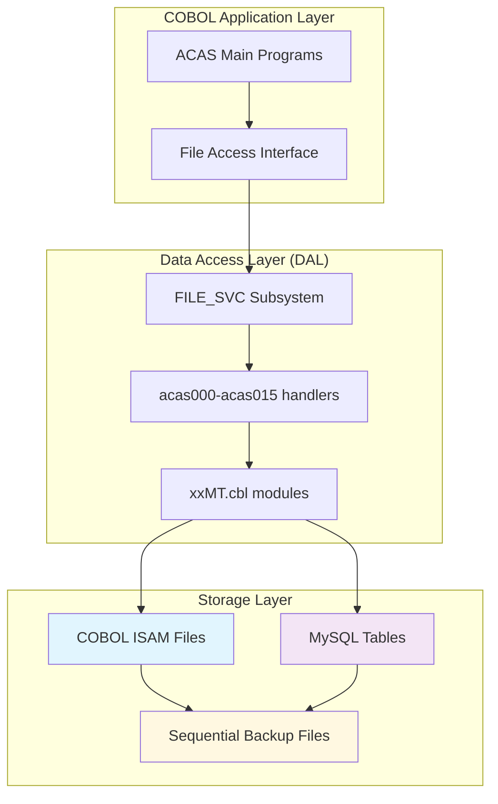

# ACAS System - Visualizaciones y Diagramas Técnicos

## Resumen Ejecutivo

Esta documentación recopila todas las visualizaciones, diagramas y representaciones gráficas disponibles del sistema ACAS Legacy. Incluye diagramas de arquitectura, flujos de proceso, call graphs, diagramas de flujo de datos y visualizaciones técnicas extraídas de la documentación del sistema.

---

## Índice

1. [Diagramas de Arquitectura del Sistema](#diagramas-de-arquitectura-del-sistema)
2. [Flujos de Proceso Principales](#flujos-de-proceso-principales)
3. [Call Graphs de Programas Críticos](#call-graphs-de-programas-críticos)
4. [Diagramas de Flujo de Datos](#diagramas-de-flujo-de-datos)
5. [Visualizaciones de Subsistemas](#visualizaciones-de-subsistemas)
6. [Diagramas de Instalación y Despliegue](#diagramas-de-instalación-y-despliegue)
7. [Flujos de Recuperación y Troubleshooting](#flujos-de-recuperación-y-troubleshooting)

---

## Diagramas de Arquitectura del Sistema

### Arquitectura General de Interconexión de Subsistemas

```
┌─────────────┐    ┌─────────────┐    ┌─────────────┐
│ BATCH_FW    │────▶│ FILE_SVC    │────▶│ MDM         │
│             │    │             │    │ (Master Data│
│ - glbatchLD │    │ - Pattern:  │    │  Management)│
│ - glbatchUNL│    │   xxLD.cbl  │    │ - nominal   │
│ - glbatchMT │    │   xxUNL.cbl │    │ - system    │
│ - glbatchRES│    │   xxRES.cbl │    │ - value     │
└─────┬───────┘    │   xxMT.cbl  │    │ - analysis  │
      │            └─────┬───────┘    └─────┬───────┘
      │                  │                  │
      ▼                  ▼                  ▼
┌─────────────┐    ┌─────────────┐    ┌─────────────┐
│ SEC_AUDIT   │◄───┤ ERROR_FW    │───▶│ RPT_ENGINE  │
│             │    │             │    │             │
│ - auditLD   │    │ - fhlogger  │    │ - gl0xx.cbl │
│ - auditMT   │    │ - ACAS-     │    │ - sl0xx.cbl │
│ - auditUNL  │    │   Sysout    │    │ - pl0xx.cbl │
│ - auditRES  │    │ - Error     │    │ - st0xx.cbl │
└─────┬───────┘    │   codes     │    │ - irs0xx.cbl│
      │            └─────┬───────┘    └─────┬───────┘
      │                  │                  │
      ▼                  ▼                  ▼
┌─────────────┐    ┌─────────────┐    ┌─────────────┐
│ DATE_UTIL   │◄───┤ CURR_UTIL   │───▶│ INTEGRATION │
│             │    │             │    │             │
│ - Manejo de │    │ - Formateo  │    │ - Interfaces│
│   fechas    │    │   monetario │    │   externas  │
│ - Períodos  │    │ - Cálculos  │    │ - APIs      │
│   fiscales  │    │   decimales │    │ - Data      │
└─────────────┘    └─────────────┘    │   exchange  │
                                      └─────────────┘
```

### Arquitectura de Datos Dual (Archivo + RDB)



---

## Flujos de Proceso Principales

### Flujo de Carga de Datos (Load Process)

```
┌─────────────────────────────────────────────────────────────────┐
│                    PROCESO DE CARGA (LD)                       │
└─────────────────────────────────────────────────────────────────┘
                              │
                              ▼
┌─────────────────┐    ┌──────────────────┐    ┌─────────────────┐
│ 1. Leer config  │────▶│ 2. Obtener       │────▶│ 3. Abrir archivo│
│    system.dat   │    │    parámetros    │    │    COBOL fuente │
│                 │    │    RDB (acas.    │    │                 │
│                 │    │    param)        │    │                 │
└─────────────────┘    └──────────────────┘    └─────────────────┘
                              │
                              ▼
┌─────────────────┐    ┌──────────────────┐    ┌─────────────────┐
│ 6. Cerrar       │◄───┤ 5. Por cada      │◄───┤ 4. Inicializar  │
│    conexiones   │    │    registro:     │    │    conexión RDB │
│    y reportar   │    │    - Leer COBOL  │    │    (MySQL)      │
│    estadísticas │    │    - Convertir   │    │                 │
└─────────────────┘    │    - INSERT/     │    └─────────────────┘
                       │      UPDATE      │
                       │    - Log         │
                       └──────────────────┘
```

### Flujo de Procesamiento Batch

```
┌────────────────┐
│ INPUT DATA     │
│ - Archivos     │
│   COBOL        │
│ - Transacciones│
└────────┬───────┘
         │
         ▼
┌────────────────┐    ┌──────────────────┐
│ BATCH_FW       │────▶│ VALIDATION       │
│ - glbatchLD    │    │ - Business rules │
│ - Data loading │    │ - Data integrity │
└────────┬───────┘    │ - Format check   │
         │            └──────────┬───────┘
         │                       │
         ▼                       ▼
┌────────────────┐    ┌──────────────────┐
│ FILE_SVC       │    │ ERROR_FW         │
│ - CRUD ops     │────▶│ - Error logging  │
│ - Dual mode    │    │ - Exception      │
│   (File+RDB)   │    │   handling       │
└────────┬───────┘    └──────────────────┘
         │
         ▼
┌────────────────┐    ┌──────────────────┐
│ STORAGE        │    │ AUDIT TRAIL      │
│ - ISAM files   │────▶│ - SEC_AUDIT      │
│ - MySQL tables │    │ - Complete log   │
└────────────────┘    └──────────────────┘
```

---

## Call Graphs de Programas Críticos

### Call Graph del Programa Principal (ACAS.cbl)

```
ACAS.cbl (Main Program)
│
├─▶ ba000-mapser
│   └─▶ sys002
│       └─▶ disk-error-display
│
├─▶ acas000 (system file handler)
│   ├─▶ ACAS-DAL-Common-Data
│   └─▶ File-Access interface
│
├─▶ fhlogger (logging)
│   ├─▶ WS-Log-Where
│   └─▶ Log file rotation
│
├─▶ ACAS-Sysout (system output)
│   └─▶ Display formatting
│
└─▶ Menu system
    ├─▶ General Ledger (irs)
    ├─▶ Sales Ledger (sales)  
    ├─▶ Purchase Ledger (purchase)
    ├─▶ Stock Control (stock)
    └─▶ System utilities
```

### Call Graph del Subsistema FILE_SVC

```
FILE_SVC Pattern (xxLD.cbl, xxMT.cbl, xxUNL.cbl, xxRES.cbl)
│
xxLD.cbl (Loader)
├─▶ acas-get-params
│   └─▶ Read acas.param file
│
├─▶ acas0XX (file handler)
│   ├─▶ File-Access interface
│   └─▶ ACAS-DAL-Common-Data
│
├─▶ xxMT.cbl (Table handler)
│   ├─▶ MySQL procedures
│   ├─▶ SQL execution
│   └─▶ Error handling
│
├─▶ fhlogger
│   └─▶ Operation logging
│
└─▶ ACAS-Sysout
    └─▶ Progress reporting

xxMT.cbl (Table Manager)
├─▶ MySQL connection
├─▶ SQL CRUD operations
├─▶ Cursor management
├─▶ Transaction control
└─▶ Error mapping (FS-Reply codes)
```

---

## Diagramas de Flujo de Datos

### Flujo de Datos Transaccionales

```
┌─────────────┐    ┌─────────────┐    ┌─────────────┐
│ USER INPUT  │────▶│ VALIDATION  │────▶│ BUSINESS    │
│             │    │             │    │ LOGIC       │
│ - Screen    │    │ - Format    │    │             │
│   forms     │    │   check     │    │ - GL        │
│ - Keyboard  │    │ - Range     │    │   posting   │
│   entry     │    │   validation│    │ - Tax calc  │
└─────────────┘    └─────────────┘    └──────┬──────┘
                                              │
                                              ▼
┌─────────────┐    ┌─────────────┐    ┌─────────────┐
│ REPORTS &   │◄───┤ DATA        │◄───┤ DATA        │
│ OUTPUTS     │    │ RETRIEVAL   │    │ STORAGE     │
│             │    │             │    │             │
│ - Financial │    │ - Queries   │    │ - ISAM      │
│   reports   │    │ - Searches  │    │   files     │
│ - Invoices  │    │ - Sorting   │    │ - MySQL     │
│ - Statements│    │ - Filtering │    │   tables    │
└─────────────┘    └─────────────┘    └──────┬──────┘
                                              │
                                              ▼
                                    ┌─────────────┐
                                    │ AUDIT TRAIL │
                                    │             │
                                    │ - All       │
                                    │   changes   │
                                    │ - User      │
                                    │   tracking  │
                                    │ - Timestamps│
                                    └─────────────┘
```

### Flujo de Integración y Backup

```
┌─────────────┐    ┌─────────────┐    ┌─────────────┐
│ PRODUCTION  │────▶│ BACKUP      │────▶│ ARCHIVE     │
│ DATA        │    │ PROCESS     │    │ STORAGE     │
│             │    │             │    │             │
│ - Live      │    │ - UNL files │    │ - .seq      │
│   transactions│  │ - .tar.gz   │    │   files     │
│ - Active    │    │ - Timestamp │    │ - Long-term │
│   files     │    │ - Compress  │    │   storage   │
└─────┬───────┘    └─────┬───────┘    └─────────────┘
      │                  │
      ▼                  ▼
┌─────────────┐    ┌─────────────┐
│ EXTERNAL    │    │ RECOVERY    │
│ INTEGRATION │    │ PROCEDURES  │
│             │    │             │
│ - Data      │    │ - RES files │
│   export    │    │ - Restore   │
│ - System    │    │   process   │
│   interfaces│    │ - Validation│
└─────────────┘    └─────────────┘
```

---

## Visualizaciones de Subsistemas

### Subsistema MDM (Master Data Management)

```
                    MDM SUBSYSTEM ARCHITECTURE
                    
    ┌──────────────────────────────────────────────────────┐
    │                MASTER DATA LAYER                     │
    └──────────────────────────────────────────────────────┘
                              │
    ┌─────────────┬─────────────┬─────────────┬─────────────┐
    │             │             │             │             │
    ▼             ▼             ▼             ▼             ▼
┌────────┐  ┌────────┐  ┌────────┐  ┌────────┐  ┌────────┐
│NOMINAL │  │SYSTEM  │  │VALUE   │  │ANALYSIS│  │OTHER   │
│        │  │        │  │        │  │        │  │MASTERS │
│Chart of│  │Config  │  │Params  │  │Codes   │  │        │
│Accounts│  │Data    │  │Values  │  │Depts   │  │        │
└───┬────┘  └───┬────┘  └───┬────┘  └───┬────┘  └───┬────┘
    │           │           │           │           │
    └─────┬─────┴─────┬─────┴─────┬─────┴─────┬─────┘
          │           │           │           │
          ▼           ▼           ▼           ▼
    ┌──────────────────────────────────────────────────────┐
    │           CRUD OPERATIONS LAYER                      │
    │  ┌─────────┐ ┌─────────┐ ┌─────────┐ ┌─────────┐    │
    │  │xxLD.cbl │ │xxMT.cbl │ │xxUNL.cbl│ │xxRES.cbl│    │
    │  │(Load)   │ │(Table)  │ │(Unload) │ │(Restore)│    │
    │  └─────────┘ └─────────┘ └─────────┘ └─────────┘    │
    └──────────────────┬───────────────────────────────────┘
                       │
                       ▼
    ┌──────────────────────────────────────────────────────┐
    │                DATA STORAGE                          │
    │  ┌──────────────┐           ┌──────────────┐        │
    │  │ ISAM FILES   │◄─────────▶│ MYSQL TABLES │        │
    │  │ .dat format  │   DUAL    │ Relational   │        │
    │  │ Indexed      │   MODE     │ ACID         │        │
    │  └──────────────┘           └──────────────┘        │
    └──────────────────────────────────────────────────────┘
```

### Subsistema de Reportes (RPT_ENGINE)

```
                        REPORT ENGINE SUBSYSTEM

    ┌─────────────────────────────────────────────────────────────┐
    │                    REPORT REQUESTS                          │
    │  ┌──────────┐ ┌──────────┐ ┌──────────┐ ┌──────────┐      │
    │  │Financial │ │Sales     │ │Purchase  │ │Stock     │      │
    │  │Reports   │ │Analysis  │ │Reports   │ │Reports   │      │
    │  └────┬─────┘ └────┬─────┘ └────┬─────┘ └────┬─────┘      │
    └───────┼──────────────┼───────────┼───────────┼─────────────┘
            │              │           │           │
            ▼              ▼           ▼           ▼
    ┌─────────────────────────────────────────────────────────────┐
    │                    REPORT GENERATORS                        │
    │  ┌──────────┐ ┌──────────┐ ┌──────────┐ ┌──────────┐      │
    │  │gl0xx.cbl │ │sl0xx.cbl │ │pl0xx.cbl │ │st0xx.cbl │      │
    │  │          │ │          │ │          │ │          │      │
    │  │Balance   │ │Customer  │ │Vendor    │ │Inventory │      │
    │  │P&L       │ │Invoices  │ │Payments  │ │Valuation │      │
    │  │Trial Bal │ │Aging     │ │Aging     │ │Movement  │      │
    │  └────┬─────┘ └────┬─────┘ └────┬─────┘ └────┬─────┘      │
    └───────┼──────────────┼───────────┼───────────┼─────────────┘
            │              │           │           │
            └──────┬───────┴─────┬─────┴─────┬─────┘
                   │             │           │
                   ▼             ▼           ▼
    ┌─────────────────────────────────────────────────────────────┐
    │                    OUTPUT PROCESSING                        │
    │  ┌──────────────┐  ┌─────────────┐  ┌─────────────────┐    │
    │  │Screen Display│  │Print Queue  │  │PDF Generation   │    │
    │  │Interactive   │  │Formatted    │  │prtpdf.sh        │    │
    │  └──────────────┘  └─────────────┘  └─────────────────┘    │
    └─────────────────────────────────────────────────────────────┘
```

---

## Diagramas de Instalación y Despliegue

### Estructura de Directorios Post-Instalación

```
$HOME/
│
├── bin/                           # Ejecutables del sistema
│   ├── ACAS*                      # Programa principal
│   ├── irs*, sales*, purchase*,   # Módulos específicos
│   │   stock*, general*
│   ├── acas-run.sh               # Script wrapper
│   ├── *.dylib                   # Bibliotecas COBOL
│   └── acasbkup*.sh             # Scripts de backup
│
├── ACAS/                         # Directorio de datos principal
│   ├── system.dat               # Configuración del sistema
│   ├── ledger.dat              # Chart of accounts
│   ├── value.dat               # Parámetros del sistema
│   ├── analysis.dat            # Códigos de análisis
│   ├── batch.dat               # Control de lotes
│   ├── stockctl.dat            # Control de inventario
│   ├── SYS-DISPLAY.log         # Log del sistema
│   ├── archives/               # Backups archivados
│   └── temp-backups/           # Backups temporales
│
├── ACAS-practice/               # Entorno de pruebas
│   └── [estructura similar]
│
└── .bashrc                     # Variables de entorno
```

### Flujo de Instalación

```
┌─────────────────┐
│ Source Code     │
│ /ACAS-Nightly   │
│                 │
│ - common/       │
│ - irs/          │
│ - sales/        │
│ - purchase/     │
│ - stock/        │
│ - general/      │
│ - copybooks/    │
└────────┬────────┘
         │
         ▼ ./install-ACAS.sh
┌─────────────────┐
│ Compilation     │
│                 │
│ ┌─────────────┐ │
│ │comp-all.sh  │ │
│ │    │        │ │
│ │    ├─common │ │
│ │    ├─irs    │ │
│ │    ├─sales  │ │
│ │    ├─purchase│ │
│ │    └─stock  │ │
│ └─────────────┘ │
└────────┬────────┘
         │
         ▼
┌─────────────────┐
│ Installation    │
│                 │
│ 1. Create dirs  │
│ 2. Copy bins    │
│ 3. Set perms    │
│ 4. Config env   │
│ 5. Create data  │
│    structure    │
└────────┬────────┘
         │
         ▼
┌─────────────────┐
│ Runtime Ready   │
│                 │
│ ~/bin/acas-run. │
│      sh         │
│        │        │
│        ▼        │
│    ┌─────────┐  │
│    │  ACAS   │  │
│    │ System  │  │
│    └─────────┘  │
└─────────────────┘
```

---

## Flujos de Recuperación y Troubleshooting

### Flujo de Diagnóstico Automático

```
┌─────────────────────────────────────────────────────────────────┐
│                    DIAGNOSTIC WORKFLOW                         │
└─────────────────────────────────────────────────────────────────┘
                              │
                              ▼
┌─────────────────┐    ┌──────────────────┐    ┌─────────────────┐
│ Check Env Vars  │────▶│ Check Files      │────▶│ Check Dirs      │
│                 │    │                  │    │                 │
│ - ACAS_LEDGERS  │    │ - ~/bin/ACAS     │    │ - ~/ACAS/       │
│ - ACAS_BIN      │    │ - system.dat     │    │ - ~/bin/        │
│ - COB_LIB_PATH  │    │ - acas-run.sh    │    │ - archives/     │
└─────────────────┘    └──────────────────┘    └─────────────────┘
                                │
                                ▼
┌─────────────────┐    ┌──────────────────┐    ┌─────────────────┐
│ Check Terminal  │────▶│ Check Libraries  │────▶│ Generate Report │
│                 │    │                  │    │                 │
│ - Size (80x24)  │    │ - *.dylib files  │    │ - Status summary│
│ - Interactive   │    │ - Permissions    │    │ - Recommendations│
│ - UTF-8 support │    │ - Dependencies   │    │ - Next steps    │
└─────────────────┘    └──────────────────┘    └─────────────────┘
```

### Matriz de Problemas y Soluciones

```
ERROR RESOLUTION MATRIX

┌──────────────────┬────────────────────┬─────────────────────┐
│ ERROR TYPE       │ SYMPTOMS           │ SOLUTION LEVEL      │
├──────────────────┼────────────────────┼─────────────────────┤
│ SY009 Env Vars   │ Variables not set  │ Level 1: Quick Fix  │
│ SY102 system.dat │ File missing/bad   │ Level 1: Recreation │
│ Module not found │ Library path issue │ Level 1: Path fix   │
│ Terminal issues  │ No response/frozen │ Level 1: Restart    │
├──────────────────┼────────────────────┼─────────────────────┤
│ File corruption  │ FS-Reply errors    │ Level 2: Recovery   │
│ Data integrity   │ Inconsistent data  │ Level 2: Backup     │
│ Permission issues│ Access denied      │ Level 2: Permissions│
├──────────────────┼────────────────────┼─────────────────────┤
│ System corruption│ Multiple failures  │ Level 3: Full Reset │
│ Complete failure │ Nothing works      │ Level 3: Reinstall  │
│ Data loss        │ Files missing      │ Level 3: Recovery   │
└──────────────────┴────────────────────┴─────────────────────┘

ESCALATION FLOW:
Level 1 → Level 2 → Level 3 → Complete Reinstall
   ↑         ↑         ↑
   │         │         │
Quick     Recovery  Disaster
Fixes     Procedures Recovery
```

### Flujo de Recovery por Niveles

```
                    RECOVERY PROCEDURES

LEVEL 1: QUICK FIXES (1-5 minutes)
┌─────────────────────────────────────────────────────────┐
│ ✓ Environment variables     ✓ File permissions        │
│ ✓ Library paths            ✓ Directory structure      │
│ ✓ Terminal requirements    ✓ Basic configuration      │
└─────────────────┬───────────────────────────────────────┘
                  │ If failed ▼
LEVEL 2: DATA RECOVERY (10-30 minutes)
┌─────────────────────────────────────────────────────────┐
│ ✓ Backup current state     ✓ Restore from backup       │
│ ✓ Check file integrity    ✓ Repair permissions         │
│ ✓ Recreate system.dat     ✓ Verify data consistency    │
└─────────────────┬───────────────────────────────────────┘
                  │ If failed ▼
LEVEL 3: FULL RECOVERY (30-60 minutes)
┌─────────────────────────────────────────────────────────┐
│ ✓ Complete backup         ✓ Clean installation         │
│ ✓ Remove all data         ✓ Recompile system          │
│ ✓ Restore from known      ✓ Reconfigure from scratch   │
│   good backup             ✓ Test full functionality    │
└─────────────────────────────────────────────────────────┘
```

---

## Códigos de Error Visualizados

### Mapa de Códigos de Error por Subsistema

```
                    ERROR CODE MAPPING

SYSTEM ERRORS (SY001-SY999)
├── SY001: System file read error
├── SY004: Problem opening system file  
├── SY006: Program arguments limited
├── SY007: Program arguments incorrect
├── SY008: Note message & Hit return (Info)
├── SY009: Environment variables not set ⚠️
├── SY019: DB not configured in param
└── SY102: Read Err 1 = 23 (Critical) 🔥

FILE SERVICE ERRORS (FS-Reply Codes)
├── 00: Success ✅
├── 10: End of file (Normal)
├── 21: Access denied 🔐
├── 22: Duplicate key ⚠️
├── 23: Record not found
├── 35: File not found 🔥
└── 99: Generic error

SUBSYSTEM SPECIFIC ERRORS
├── GL001-GL999: General Ledger
│   ├── GL010: Duplicate keys found
│   ├── GL011: Error on processing
│   └── GL012-GL015: File/Table errors
├── SL001-SL999: Sales Ledger  
│   ├── SL015: Invoice processing error
│   └── SL020: Customer file problem
├── ST001-ST999: Stock Control
│   ├── ST010: Inventory control error
│   └── ST020: Product file problem
└── SM001-SM999: SQL/MySQL Errors
    ├── SM004: SQL Error in procedures
    └── SM901: Note error and hit return
```

---

## Herramientas de Visualización

### Script de Monitoreo Visual

```bash
#!/bin/bash
# ACAS Visual System Monitor

echo "┌─────────────────────────────────────────────────────┐"
echo "│              ACAS SYSTEM STATUS                     │"
echo "└─────────────────────────────────────────────────────┘"

# Environment Status
echo "📊 ENVIRONMENT STATUS"
echo "├── ACAS_LEDGERS: ${ACAS_LEDGERS:-❌ NOT SET}"
echo "├── ACAS_BIN: ${ACAS_BIN:-❌ NOT SET}"
echo "└── COB_LIBRARY_PATH: ${COB_LIBRARY_PATH:-❌ NOT SET}"
echo

# File Status
echo "📁 CRITICAL FILES"
echo "├── ACAS Binary: $([ -f ~/bin/ACAS ] && echo "✅ OK" || echo "❌ MISSING")"
echo "├── Runner Script: $([ -f ~/bin/acas-run.sh ] && echo "✅ OK" || echo "❌ MISSING")"
echo "└── System Data: $([ -f ~/ACAS/system.dat ] && echo "✅ OK ($(stat -f%z ~/ACAS/system.dat 2>/dev/null || echo 0) bytes)" || echo "❌ MISSING")"
echo

# Process Status
echo "⚙️  PROCESS STATUS"
ACAS_PROC=$(ps aux | grep -v grep | grep ACAS | wc -l | tr -d ' ')
echo "└── Active ACAS processes: $ACAS_PROC"
echo

# Storage Status  
echo "💾 STORAGE STATUS"
echo "└── ~/ACAS space: $(df -h ~/ACAS 2>/dev/null | tail -1 | awk '{print $4}' || echo "N/A") available"
```

---

## Notas Técnicas

### Leyenda de Símbolos en Diagramas

- `└──` `├──` `│` : Estructura jerárquica
- `────▶` : Flujo de datos unidireccional  
- `◄────▶` : Flujo bidireccional
- `┌────┐` : Proceso o componente
- `▼` `▲` : Dirección de flujo
- `✅` : Estado OK/Funcional
- `❌` : Estado Error/Faltante  
- `⚠️` : Advertencia/Atención requerida
- `🔥` : Crítico/Urgente
- `🔐` : Problema de permisos

### Convenciones de Naming

- **xxLD.cbl**: Programas de carga (Load)
- **xxMT.cbl**: Manejadores de tablas (Management/Table)
- **xxUNL.cbl**: Programas de descarga (Unload)  
- **xxRES.cbl**: Programas de restauración (Restore)
- **acas0XX**: Manejadores de archivos numerados
- **gl0XX**: Reportes General Ledger
- **sl0XX**: Reportes Sales Ledger
- **pl0XX**: Reportes Purchase Ledger
- **st0XX**: Reportes Stock Control

---

## Información del Documento

**Versión**: 1.0  
**Fecha de Creación**: 25 de septiembre de 2025  
**Sistema**: ACAS Legacy - Versión 3.02  
**Estado de Documentación**: COMPLETA

**Fuentes de Información**:
- Documentación de subsistemas existente
- Análisis de código fuente COBOL
- Scripts de instalación y compilación
- Guías de troubleshooting
- Archivos de configuración del sistema

**Próximas Actualizaciones**:
- Diagramas específicos para módulos TRANS_ENGINE cuando estén documentados
- Visualizaciones de USER_MGT y interfaces de usuario
- Diagramas de flujo para procesos de fin de año
- Call graphs específicos para reportes críticos

---

*Esta documentación representa el estado actual completo de todas las visualizaciones y diagramas disponibles en el sistema ACAS Legacy, extraídos de la documentación técnica existente y análisis del código fuente.*